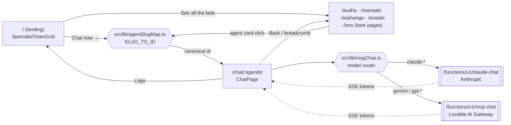

# Assembl — the operating system for NZ business

Assembl is a governed, multi-agent platform for New Zealand operators. It pairs
streaming chat with a network of 46 specialist agents organised into eight
industry **kete** (baskets), every response routed through the **Mana Trust
Layer** (PII masking → tier gate → in-flight stamp → post-rewrite) and finished
with an evidence pack you can hand to a regulator or client.

Live: <https://assembl.co.nz> · <https://www.assembl.co.nz>

---

## Quickstart

Copy-paste the block below to clone, install, run, and verify that streaming
chat is working end-to-end. Requires **Node 20+** (Node 22 recommended) and
either `npm`, `pnpm`, or `bun`.

```bash
# 1. Clone + enter
git clone https://github.com/<your-org>/assembl.git
cd assembl

# 2. Install dependencies
npm install

# 3. Start the Vite dev server (http://localhost:5173)
npm run dev
```

`.env` is auto-managed by Lovable Cloud — `VITE_SUPABASE_URL` and
`VITE_SUPABASE_PUBLISHABLE_KEY` are already populated, so the dev server
talks to the same backend (Postgres, RLS, edge functions) as production.

### Verify chat streaming end-to-end

In a **second terminal**, hit the secret-check function to confirm the keys
the chat pipeline depends on are present (no values are ever returned):

```bash
# Pull the URL + publishable key out of .env
source <(grep -E '^VITE_SUPABASE_(URL|PUBLISHABLE_KEY)=' .env | sed 's/^/export /')

curl -s "$VITE_SUPABASE_URL/functions/v1/toroa-secret-check" \
  -H "Authorization: Bearer $VITE_SUPABASE_PUBLISHABLE_KEY" | jq
# Expect: { "ok": true, "secrets": [ { "name": "LOVABLE_API_KEY", "set": true }, … ] }
```

Then stream a real chat turn straight from the terminal. This hits
`mcp-chat` (Lovable AI Gateway → Gemini/GPT-5) and prints raw SSE
`data: …` frames as tokens arrive — if you see lines streaming
in one-by-one, the full pipeline (auth → Mana Trust Layer → upstream
model → SSE) is working:

```bash
curl -N "$VITE_SUPABASE_URL/functions/v1/mcp-chat" \
  -H "Content-Type: application/json" \
  -H "Authorization: Bearer $VITE_SUPABASE_PUBLISHABLE_KEY" \
  -d '{
    "agentId": "manaaki",
    "messages": [{ "role": "user", "content": "Say hi in te reo Māori." }]
  }'
```

To verify Claude streaming (uses `ANTHROPIC_API_KEY`), repeat with the
`claude-chat` endpoint and a Claude model:

```bash
curl -N "$VITE_SUPABASE_URL/functions/v1/claude-chat" \
  -H "Content-Type: application/json" \
  -H "Authorization: Bearer $VITE_SUPABASE_PUBLISHABLE_KEY" \
  -d '{
    "agentId": "manaaki",
    "model": "claude-3-5-sonnet-latest",
    "messages": [{ "role": "user", "content": "Stream a one-line greeting." }]
  }'
```

Finally, open <http://localhost:5173/manaaki>, send a message in the chat
widget, and confirm the assistant reply appears **token-by-token**. That
confirms `streamMcpChat` (`src/lib/mcpChat.ts`) is parsing the SSE frames
correctly in the browser.

> **401?** Sign in first (`/auth`) — both endpoints require a Supabase JWT.
> **402 / 429?** You've hit Lovable AI Gateway billing or rate limits —
> top up at *Settings → Workspace → Usage*.
> **`LOVABLE_API_KEY not configured`** in logs → re-enable Lovable Cloud
> from the project's **Connectors** panel.

For deeper local-development notes (scripts, edge function workflow, full
secret reference) see [Running locally](#running-locally) and
[`docs/ENVIRONMENT.md`](docs/ENVIRONMENT.md).

---

## Table of contents

1. [Architecture](#architecture)
2. [Tech stack](#tech-stack)
3. [Repository layout](#repository-layout)
4. [Key routes](#key-routes)
5. [Edge functions](#edge-functions)
6. [Mana Trust Layer & streaming chat](#mana-trust-layer--streaming-chat)
7. [Running locally](#running-locally)
8. [Environment & secrets](#environment--secrets)
9. [Testing & quality](#testing--quality)
10. [Deployment](#deployment)

---

## Architecture

Assembl is a **Vite + React 18 SPA** front end, backed by **Lovable Cloud**
(managed Supabase) for authentication, Postgres + RLS, storage, realtime, and
**edge functions** for every server-side concern (chat streaming, payments,
compliance scanning, IoT pulls, messaging, etc.).

```
┌────────────────────────────────────────────────────────────────────┐
│                      React 18 + Vite SPA                           │
│  • 8 industry kete  • per-agent settings  • streaming chat UI      │
│  • Pearl design system (Cormorant + Inter, #FBFAF7 / #1F4D47)      │
└──────────────┬───────────────────────────────────────┬─────────────┘
               │ supabase-js (auth + RLS queries)      │ fetch (SSE)
               ▼                                       ▼
┌──────────────────────────────┐    ┌────────────────────────────────┐
│   Postgres + RLS (Cloud)     │    │      Edge Functions (Deno)     │
│  user_roles · agent_memory   │    │  mcp-chat   ← Lovable AI GW    │
│  conversations · evidence    │    │  claude-chat ← Anthropic       │
│  knowledge_base · audit_log  │    │  iho · kahu · ta · mana        │
└──────────────────────────────┘    └────────────────────────────────┘
                                               │
                                               ▼
                            ┌─────────────────────────────────────────┐
                            │ External providers (server-side only)   │
                            │ Anthropic · OpenAI · Google · Stripe    │
                            │ Twilio/TNZ · ElevenLabs · Xero · Buffer │
                            └─────────────────────────────────────────┘
```

**Key principles**

- **Sovereignty by default** — every model call passes through the
  Kahu → Iho → Tā → Mana pipeline. No tokens leave the tenant unmasked.
- **RLS everywhere** — roles live in a separate `user_roles` table; admin
  checks always go through a `SECURITY DEFINER` function.
- **Draft-only autonomy** — agents never act without a human approval step.
- **Evidence packs** — every workflow ends with a citable, branded artefact.

---

## Tech stack

| Layer        | Choice                                                          |
| ------------ | --------------------------------------------------------------- |
| Framework    | React 18, Vite 6, TypeScript 5                                  |
| Styling      | Tailwind v3, custom Pearl tokens, `framer-motion`               |
| UI primitives| `shadcn/ui` (Radix), `lucide-react`                             |
| State/data   | `@tanstack/react-query`, `zustand`, React Context               |
| 3D / maps    | `three`, `@react-three/fiber`, `react-leaflet`                  |
| Backend      | Lovable Cloud (Supabase) — Auth, Postgres + RLS, Storage, Edge  |
| AI providers | Anthropic Claude, OpenAI GPT-5, Google Gemini (via Lovable AI)  |
| Payments     | Stripe (NZD, GST-aware)                                         |
| Messaging    | TNZ + Twilio (SMS / WhatsApp) via the Unified Channel Gateway   |
| Testing      | Vitest, Testing Library, Playwright                             |

---

## Repository layout

```
src/
├─ pages/                  # All routed pages (lazy-loaded in App.tsx)
├─ components/
│  ├─ kete/                # Industry kete shell + cards
│  ├─ chat/                # Streaming chat surfaces, settings panel
│  ├─ marama/              # Mārama design system primitives
│  └─ ...                  # BrandNav, BrandFooter, SEO, etc.
├─ hooks/                  # useAuth, useAgentChatParams, etc.
├─ lib/
│  └─ mcpChat.ts           # SSE client for /mcp-chat & /claude-chat
├─ contexts/               # PersonalizationContext, BrandDnaContext, …
├─ data/                   # Static content (kete briefs, prompts)
├─ integrations/supabase/  # Auto-generated client + types (do not edit)
└─ assets/                 # Hero images, glow icons, branding

supabase/
├─ functions/              # 100+ Deno edge functions (see below)
└─ migrations/             # SQL migrations (managed; do not edit by hand)
```

---

## Key routes

The router lives in `src/App.tsx`. Highlights:

### Public marketing
- `/` — Pearl homepage (`PearlIndex`)
- `/how-it-works` — narrative product tour
- `/capabilities` — what Assembl does (streaming chat, agent picker, Claude…)
- `/pricing`, `/about`, `/contact`, `/security`
- `/data-sovereignty`, `/privacy`, `/terms`, `/cookies`

### Industry kete (eight)
- `/manaaki` — Hospitality
- `/waihanga/about` — Construction
- `/auaha/about` — Creative
- `/arataki` — Automotive
- `/pikau` — Customs & Freight
- `/hoko` — Retail
- `/ako` — Early Childhood
- `/toro` — Family / household

Each kete has its own dashboard, workflow runner, and chat surface; for
example: `/auaha/generate`, `/waihanga/workflows`, `/toro/app`.

### Chat & agents
- `/chat/:agentId` — streamed chat with any of the 46 specialists
- `/agents` — agent marketplace
- `/embed/:agentId` — embeddable chat widget

### Tools & demos
- `/roi` — NZD ROI calculator
- `/simulator` — scenario simulator (3 packs)
- `/demos` — interactive governance demos
- `/voyage/plan`, `/voyage/command` — Tōro travel ops

### Onboarding & workspace
- `/start` — 7-stage Proof of Life onboarding
- `/workspace` — branded post-onboarding dashboard

### Admin (gated by `user_roles` + `has_role` RPC)
- `/admin` — login
- `/admin/dashboard`, `/admin/messaging`, `/admin/test-lab`,
  `/admin/knowledge`, `/admin/compliance`, `/admin/mcp/*`, …

---

## Edge functions

All server-side logic lives in `supabase/functions/`. Grouped by purpose:

### Chat & model routing
- **`mcp-chat`** — SSE proxy to Lovable AI Gateway (OpenAI/Google models),
  wrapped by the Mana Trust Layer.
- **`claude-chat`** — SSE proxy to Anthropic Claude (3.5 Sonnet, Haiku).
- **`mcp-router`**, **`mcp-lite`**, **`assembl-mcp`** — MCP server endpoints
  for external tools.
- **`iho-router`**, **`iho-intent-router`**, **`agent-router`** — intent
  classification + routing to specialist agents.

### Mana Trust Layer (governance pipeline)
- **`kahu`** — pre-flight PII detection, masking, tier gate.
- **`iho`** — model selection + grounding lookups.
- **`ta`** — in-flight stamping, audit log writes.
- **`mana`** — post-flight rewrite, citation injection.

### Specialist agents (one function per kete)
`agent-manaaki`, `agent-waihanga`, `agent-auaha`, `agent-arataki`,
`agent-pikau`, `agent-toro`, plus orchestrators like
`waihanga-orchestrator` and `kete-default-handler`.

### Memory & knowledge
- `memory-recall`, `memory-extractor`, `memory-backfill-embeddings`
- `compress-context`, `compress-conversation`
- `kb-context`, `kb-refresher`, `ikb-ingest`, `ikb-search`
- `nz-compliance-autoupdate`, `compliance-scanner`, `compliance-alerts`

### IoT & live data
`iot-weather`, `iot-ais-tracking`, `iot-vehicle-tracking`,
`iot-freight-tracking`, `iot-construction`, `iot-agri-satellite`,
`nz-fuel-prices`, `nz-routes`, `nz-weather`, `marine-weather`,
`bus-positions`, `live-travel`.

### Messaging (Unified Channel Gateway)
`tnz-inbound`, `tnz-send`, `tnz-webhook`, `send-whatsapp`,
`process-email-queue`, `send-contact-email`, `send-welcome-email`,
`echo-respond`.

### Creative & generation
`stitch-generate` (image router — Fal/OpenAI/Gemini),
`generate-image`, `generate-3d`, `generate-video`, `plan-to-3d`,
`reel-creator`, `reel-batch-render`, `elevenlabs-tts`,
`elevenlabs-conversation-token`, `te-reo-video-learn`.

### Payments, e-sign, integrations
`create-checkout`, `customer-portal`, `check-subscription`,
`toroa-stripe-webhook`, `esign-send`, `esign-sign`, `esign-view`,
`xero-sync`, `xero-oauth-start`, `xero-oauth-callback`,
`google-calendar`, `buffer-mcp`, `canva-api`, `trello-api`.

### Ops & scheduled jobs
`tick`, `run-scheduled-task`, `flux-monday-briefing`,
`weekly-score-email`, `health-check`, `signal-security`,
`generate-proactive-alerts`, `subbie-chase`, `qualify-lead`.

> Edge functions deploy automatically on push — no manual step required.
> Most functions run with `verify_jwt = true`; the Mana pipeline enforces
> tenant scoping via the JWT's `sub` claim.

---

## Mana Trust Layer & streaming chat

The client streams tokens via Server-Sent Events. `src/lib/mcpChat.ts`:

```ts
import { streamMcpChat } from "@/lib/mcpChat";

await streamMcpChat({
  agentId: "manaaki",
  messages: [{ role: "user", content: "Draft a Christmas booking confirmation" }],
  params: { model: "claude-3-5-sonnet-latest", temperature: 0.4, max_tokens: 1024 },
  onDelta: (chunk) => appendToBuffer(chunk),
  onDone:  (final) => commitMessage(final),
  onError: (e) => toast.error(e.message),
});
```

- Routes to `/functions/v1/mcp-chat` for Lovable AI Gateway models, or
  `/functions/v1/claude-chat` for any `claude-*` model.
- Honours `assembl_mana_patch.final_content` — when present, the buffer is
  replaced on close so PII rewrites land on the user's screen.
- Per-agent settings (`useAgentChatParams`) persist model + temperature +
  max-tokens choice per agent in localStorage.

---

## Running locally

### Prerequisites

- **Node 20+** (Node 22 recommended)
- **npm**, **pnpm**, or **bun**
- A modern browser

### Install + dev server

```bash
npm install
npm run dev
```

The Vite dev server starts on <http://localhost:5173>. The Lovable Cloud
backend is shared with production — local changes hit the same Postgres and
edge functions.

### Available scripts

| Script              | Purpose                                    |
| ------------------- | ------------------------------------------ |
| `npm run dev`       | Vite dev server (HMR)                      |
| `npm run build`     | Production build                           |
| `npm run build:dev` | Development-mode build (source maps)       |
| `npm run preview`   | Preview the production build               |
| `npm run lint`      | ESLint over the whole repo                 |
| `npm run test`      | Vitest (unit + component tests)            |
| `npm run test:watch`| Vitest in watch mode                       |

### Chat route map

How a visitor moves from the specialist team grid into a streaming chat
session and back out again:



Legacy marketing slugs (e.g. `/chat/hospitality`, `/chat/construction`)
are rewritten to canonical agent IDs (`aura`, `arai`, …) by `SLUG_TO_ID`
before `ChatPage` mounts, so every entry point in the grid resolves to a
single source of truth.

### Editing edge functions

Edge functions live under `supabase/functions/<name>/index.ts` and are
written in **Deno**. Push the file — deployment happens automatically. To
view live logs, use the Lovable Cloud panel or
`supabase functions logs <name>` if you have the Supabase CLI installed
locally.

### Checking edge function health locally

Edge functions don't run on your laptop — they always execute in Lovable
Cloud — but you can verify they're healthy from your dev shell. Three
signals to combine:

**1. Vite dev-server log (frontend → function calls)**

Watch the local log to see which functions the SPA is invoking and any
client-side fetch failures:

```bash
tail -f /tmp/dev-server-logs/dev-server.log
grep -nE 'error|warn|failed|vite' /tmp/dev-server-logs/dev-server.log | tail -n 50
```

**2. Per-function logs (boot, runtime errors, console output)**

Every function emits `Boot`, `Listening`, `Log`, and `Shutdown` events.
Pull them via the Supabase CLI or the Lovable Cloud panel:

```bash
supabase functions logs mcp-chat        --project-ref ssaxxdkxzrvkdjsanhei
supabase functions logs claude-chat     --project-ref ssaxxdkxzrvkdjsanhei
supabase functions logs compress-context --project-ref ssaxxdkxzrvkdjsanhei
```

A healthy chat call shows `booted (time: …ms)` followed by `Listening on
http://localhost:9999/`. Errors like `LOVABLE_API_KEY not configured`,
`401`, `402`, or `429` appear inline as `Log` entries — fix the
corresponding secret or top up gateway credit.

**3. Direct `curl` health probes**

Hit the function URLs straight from the shell. The publishable key is
enough to authenticate; pin the env vars from `.env` first:

```bash
source <(grep -E '^VITE_SUPABASE_(URL|PUBLISHABLE_KEY)=' .env | sed 's/^/export /')
AUTH=(-H "Authorization: Bearer $VITE_SUPABASE_PUBLISHABLE_KEY")

# Secret presence (no values returned)
curl -s "$VITE_SUPABASE_URL/functions/v1/toroa-secret-check" "${AUTH[@]}" | jq

# Streaming chat (Lovable AI Gateway → Gemini/GPT-5)
curl -N "$VITE_SUPABASE_URL/functions/v1/mcp-chat" "${AUTH[@]}" \
  -H "Content-Type: application/json" \
  -d '{"agentId":"manaaki","messages":[{"role":"user","content":"ping"}]}'

# Streaming chat (Anthropic)
curl -N "$VITE_SUPABASE_URL/functions/v1/claude-chat" "${AUTH[@]}" \
  -H "Content-Type: application/json" \
  -d '{"agentId":"manaaki","model":"claude-3-5-sonnet-latest","messages":[{"role":"user","content":"ping"}]}'

# Stripe / billing health
curl -s "$VITE_SUPABASE_URL/functions/v1/check-subscription" "${AUTH[@]}" | jq
```

| HTTP status | What it means | Fix |
|---|---|---|
| `200` + SSE `data:` frames | Healthy — pipeline is streaming | — |
| `401` | Missing/expired JWT | Sign in at `/auth` first |
| `402` | Lovable AI Gateway out of credit | Top up at *Settings → Workspace → Usage* |
| `429` | Rate limit | Back off, retry after a minute |
| `500` + `…_API_KEY not configured` | Secret missing in Cloud | Add via *Connectors / Secrets* |
| CORS error in browser | Function doesn't include `corsHeaders` on a response path | Patch the function |

**4. Quick all-up smoke test**

```bash
for fn in toroa-secret-check mcp-chat claude-chat check-subscription; do
  printf "%-25s " "$fn"
  curl -s -o /dev/null -w "%{http_code}\n" \
    "$VITE_SUPABASE_URL/functions/v1/$fn" "${AUTH[@]}" \
    -H "Content-Type: application/json" -d '{}'
done
```

A row of `200`/`401` (auth-gated) responses with no `5xx` means every
function in the chat pipeline is at least booting and reachable.

---

## Environment & secrets

The `.env` file is auto-managed by Lovable Cloud and contains:

```
VITE_SUPABASE_URL=…
VITE_SUPABASE_PUBLISHABLE_KEY=…   # safe to expose
VITE_SUPABASE_PROJECT_ID=…
```

Do **not** edit `.env`, `src/integrations/supabase/client.ts`, or
`src/integrations/supabase/types.ts` — they are regenerated.

Server-only secrets live in Lovable Cloud → **Connectors / Secrets**:

| Secret                  | Used by                                      |
| ----------------------- | -------------------------------------------- |
| `LOVABLE_API_KEY`       | `mcp-chat` (OpenAI/Google via gateway)       |
| `ANTHROPIC_API_KEY`     | `claude-chat`                                |
| `STRIPE_SECRET_KEY`     | `create-checkout`, `customer-portal`, …      |
| `STRIPE_WEBHOOK_SECRET` | `toroa-stripe-webhook`                       |
| `TNZ_AUTH_TOKEN`        | TNZ messaging functions                      |
| `TWILIO_*`              | WhatsApp / SMS fallback                      |
| `ELEVENLABS_API_KEY`    | TTS + voice agent                            |
| `XERO_CLIENT_*`         | Xero OAuth + sync                            |

---

## Testing & quality

- **Unit + component**: `npm run test` (Vitest + Testing Library, jsdom).
- **E2E**: Playwright lives under `tests/e2e` (run via
  `npx playwright test`).
- **Linting**: `npm run lint` (ESLint flat config, TS + React hooks rules).
- **Type-checking**: enforced by the Vite build (`tsc --noEmit` equivalent).
- **Simulation gate**: no kete moves to production without passing the
  CI simulation suite (see `mem://tech/testing/simulation-gate-strategy`).

---

## Deployment

- **Auto-deploys** on the Lovable platform.
- Custom domains: `assembl.co.nz`, `www.assembl.co.nz`.
- Edge functions deploy on push — no separate step.
- Database changes go through SQL migrations under `supabase/migrations/`
  (managed; don't edit by hand — use the migration tool).

To publish a new build, use the **Publish** action inside Lovable.

---

## Conventions

- **Design tokens only** — never hard-code colours; use the Pearl tokens
  in `src/index.css` and `tailwind.config.ts` (HSL values).
- **Charcoal text** (`#3D4250`), never pure black.
- **No generic emojis** in product copy — Soft Gold sparkle (`#D9BC7A`)
  is the official accent.
- **Te reo first-class** — bilingual labels where appropriate.
- **Roles in `user_roles`**, never on `profiles` (privilege escalation
  vector).
- **No raw secrets in client code** — only `VITE_SUPABASE_PUBLISHABLE_KEY`
  is safe to ship.

---

## Further reading

- `/capabilities` — full capability list (live page)
- `/data-sovereignty` — Māori Data Sovereignty control plane
- `/security` — security posture, breach response
- `/developers` — API + MCP docs
