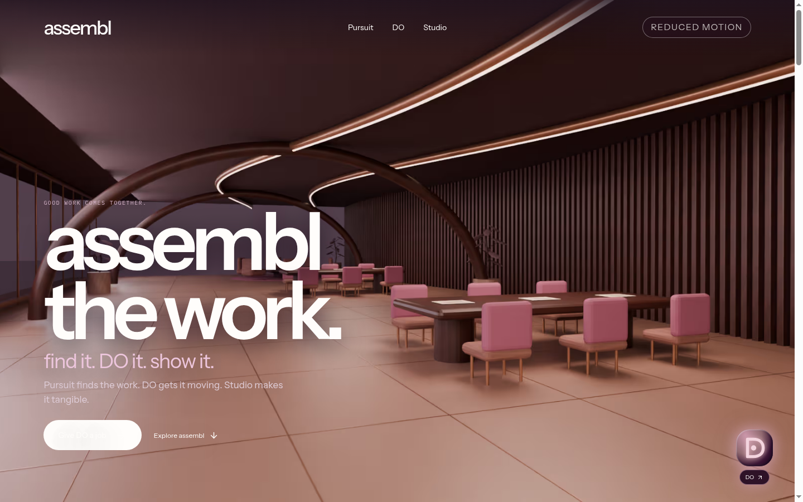
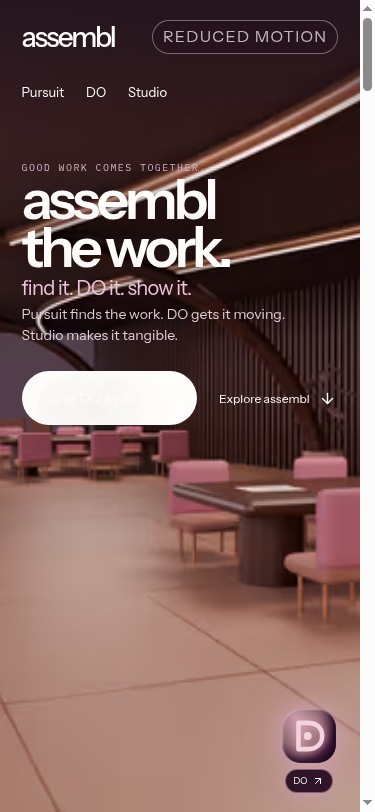
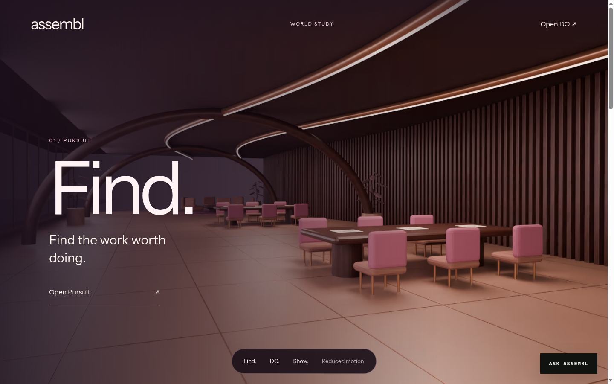
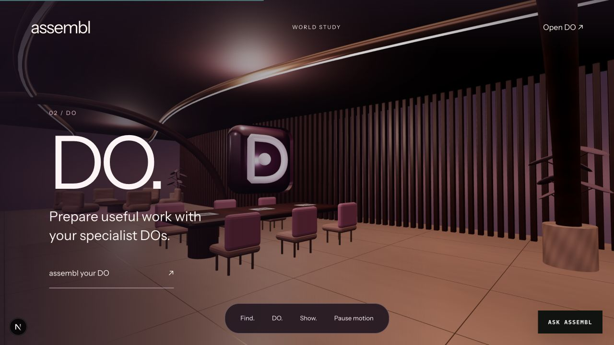
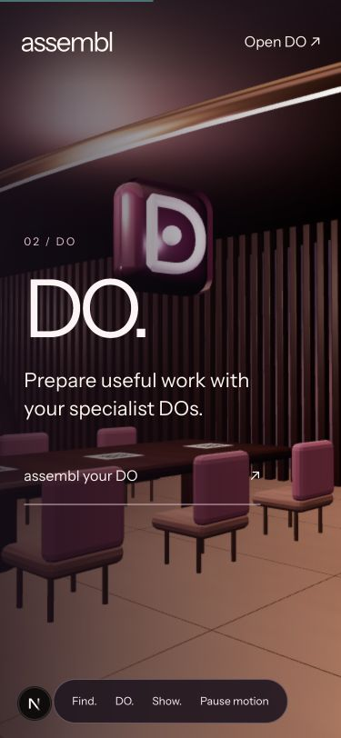

# Immersive world study

Preview: `/preview/do-world`. **Homepage hero** (`AssemblWorldHero`) reuses this same `WorldScene` + `public/do/world/atelier.glb` — no second 3D stack.

The scene is authored by `scripts/build-do-world.py` in Blender. The editable file retains its separate architecture and furniture; the browser export batches geometry by material. Current GLB: 1,704,728 bytes, 11 meshes, 11 materials, four embedded textures, Draco compression. Its poster remains visible during loading, then fades once the GLB is ready.

## This pass (cinematic fly-through + homepage hero)

R3F-only craft upgrades (no Blender re-export required for this PR):

- Chapter-hold camera path (Find / DO / Show dwell, then ease between rooms)
- Lower cinematic FOV (48°) at true eye level (~1.7–1.9 m), separate desktop/mobile paths
- Heavier scroll lag + soft gaze follow for a glide rather than snap
- Reduced-motion snaps to chapter frames (does not freeze on Find)
- Brand Identity: deep plum plaque `#240B21`, chalk contour, dusty-rose `#916A70` glow (no purple D)
- Spatial C lighting: plum field/fog, dusty-rose cove washes, warm harbour dusk shader
- ACES filmic tone mapping; rose-warmed emissive materials on the atelier GLB
- Extruded DoMark sculpture framed in the DO chapter
- Honest poster → canvas crossfade; demand rendering; pause still respected
- Homepage: `AssemblWorldHero` imports this `WorldScene` directly

## Still needs Kate’s Mac (Blender 5.x)

Cloud VM has no Blender 5.1.1. When geometry/material authoring is next on the table, run locally:

```bash
blender -b --python scripts/build-do-world.py -- /absolute/output
# copy atelier.glb + atelier-poster.png into public/do/world/
```

Suggested Blender follow-ups (not done here):

- Re-render poster from the revised arrival camera (lens ~35–40mm eye-level) so the load still matches the first frame
- Soften walnut / limestone roughness for closer R3F/ACES parity
- Optional: bake a subtle rose bounce into the cove light materials

## Checklist before claiming done

Desktop (~1280+):

- [x] Poster visible until GLB ready, then fades cleanly
- [x] Find / DO / Show each hold a readable room frame (sculpture clear on DO)
- [x] Dusty-rose glow, no purple wash in fog/sky / Identity D
- [x] Pause motion freezes the camera; reduced-motion snaps chapters (no glide)
- [x] Homepage `/` uses the same WorldScene fly-through as hero

Mobile (375):

- [x] Document width equals viewport (no horizontal scroll)
- [x] Sculpture sits higher/smaller; copy still readable
- [x] Nav + pause control usable; chapter anchors land on the right rooms

Verified 16 September 2026 (webpack `next dev`, Chrome headless WebGL): homepage `/` and `/preview/do-world` both mount `WorldScene` + `atelier.glb`. Physical-phone profiling still open. No splat renderer or live agent activity.







Earlier architecture shots:




