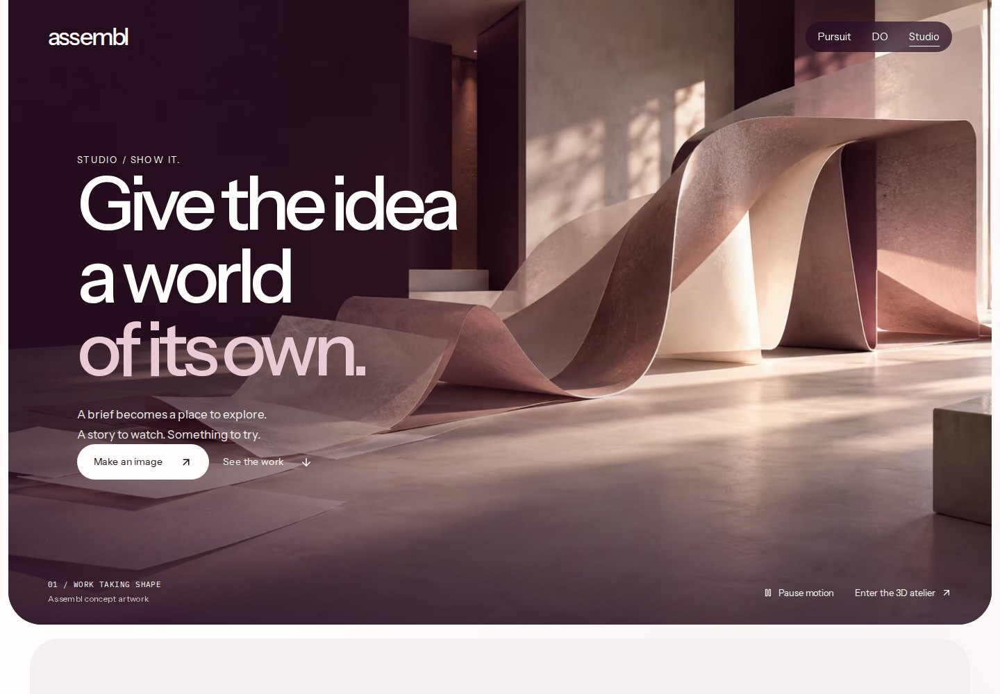
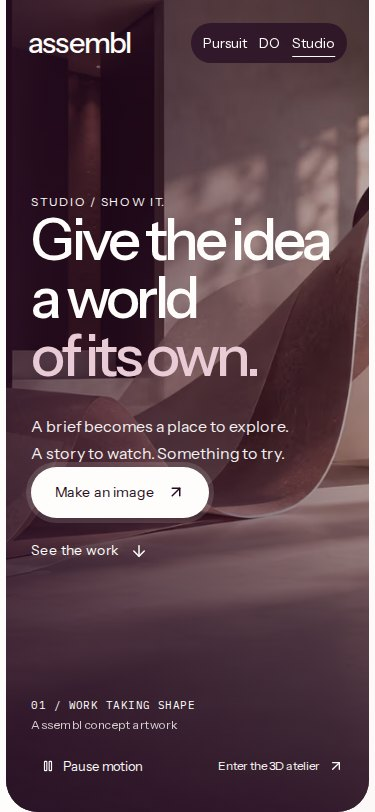

# DO, Studio and Muse working record

Date: 28 September 2026 (Pacific/Fiji).

## Task contract

- Objective: finish a useful meeting-to-work slice, improve Studio's visual craft and image controls, and establish a sourced commercial response to Muse connectors.
- Surfaces: existing Meeting DO, existing Assembl image maker and public Studio. Preserve the accepted home/DO walkthroughs and exact positioning.
- Canon loaded: AGENTS, START_HERE, context manifest/router/CURRENT, brand system, DESIGN, copy standard, Factory and primitive registry. Current source takes precedence over stale review labels in CURRENT.
- Implementation: extend shared meeting exports/sharing and existing canvas image preparation. Keep private hubs at their existing destination; no replacement workspace.
- Done: editable meeting wrap checklist and reviewed work pack; consistent crop/framing in image preview/export/post handoff; generated art integrated into a responsive motion surface; desktop/375px evidence and relevant checks; source-linked Muse findings and a bounded commercial offer.
- Authority: reversible feature branch and review deployment; retain all send, purchase, banking, publication and account permission boundaries. No Meta application or outreach sent.
- Access: connected Sites returned no editable projects on 28 September. The separate `/studios` and `/agency` source is not available and cannot be truthfully reported as changed.

## Visual thesis

Creative work taking shape: paper, translucent layers and plum architectural depth, with movement attached to a useful choice. Existing real 3D worlds remain the spatial proof. A generated still with camera motion is labelled concept artwork, never a reconstructed Gaussian splat or recorded physical location.

## Verification

- **Production build:** passed with `NODE_OPTIONS=--max-old-space-size=4096 pnpm build`. Initial default 2 GB type worker exhausted its heap; no build checks were skipped.
- **Typecheck:** passed, both standalone and inside Next production build.
- **Tests:** 100 passed across 18 suites, including the complete public Pursuit CI unit-test set plus meeting wrap/follow-through/sharing, framing and immersive tests. CI initially found a stale Studio headline expectation; the contract test now checks the new headline, work-gallery link and opt-in spatial tour while preserving its destination and privacy checks.
- **ESLint:** all changed source files pass with zero warnings. Full repo lint reports 1,173 errors and 247 warnings in the first run; its sole changed-file diagnostic was an existing unused suppression in WorldAtelierStage, removed here. Other diagnostics are outside the change. No broad cleanup was mixed into this feature.
- **Guards:** macron check passed via `node --import tsx scripts/lint-macrons.ts` (the tsx CLI IPC socket is unsupported in this runtime). Brand and front-door guards passed. Context health passed with 31 existing review warnings.
- **Browser:** 21 checks passed against the production server at 1440px and 375px. Actual WebGL scene rendered; hero pause, tour scrub and reduced-motion still worked. Recording remained consent-gated. Pack review gates, edit invalidation, share payload, transcript handoff, PNG and post handoff were exercised. No uncaught page errors or horizontal overflow in checked surfaces.
- **Hosted preview:** Vercel reported READY for application commit `f9ed227a`; HTTP checks returned 200 with expected content for `/creative-studio`, `/do/meetings` and `/creative-studio/assembl?tool=image`. Preview authentication was retained.
- **Export:** 1080 × 1350 PNG decoded successfully and its corner matched the selected plum matte `(36,11,33)`.
- **Limits:** native share-sheet invocation is simulated; physical phone recording and authenticated model/transcription calls are not covered by these checks. The private hosted hubs are outside available source access.

[Machine-readable browser checks](evidence/do-studio-20260928/result.json)

| Desktop Studio | Phone Studio |
|---|---|
|  |  |

[Actual 3D tour](evidence/do-studio-20260928/studio-tour.jpg) · [Meeting wrap on phone](evidence/do-studio-20260928/meeting-wrap-mobile.jpg) · [Image framing](evidence/do-studio-20260928/maker-frame-desktop.jpg) · [Phone framing controls](evidence/do-studio-20260928/maker-frame-mobile.jpg)

Reproduce using `scripts/review-do-studio.cjs`. Set `ASSEMBL_REVIEW_SERVER=start` after a production build; the default uses dev. `ASSEMBL_PLAYWRIGHT_MODULE`, `ASSEMBL_CHROMIUM_PATH` and `ASSEMBL_REVIEW_OUTPUT` support managed runtimes without adding a product dependency.

## Muse commercial finding

Primary-source research supports a paid one-task integration pilot for an API-owning business, with DO retaining the reusable capability and Studio demonstrating the customer journey. These are recommendations awaiting commercial validation, not a new accepted pricing canon.

- [Muse platform](https://muse.ai/platform) describes submission, review and a directory after approval; it does not establish automatic connector payouts or featured placement.
- [Meta's technical account](https://research.meta.ai/blog/security-and-safety-for-ai-agents-our-approach-with-muse) describes APIs/CLIs and a separate permission authority. A generic approval ledger or MCP wrapper is insufficient differentiation.
- [Launch geography](https://about.fb.com/news/2026/09/introducing-muse-personal-ai-agent/) is US. NZ consumer launch timing was not established.
- Initial service experiment: NZ$1,500 discovery credited against a bounded NZ$7,500 pilot; proposed NZ$750 monthly management with explicit usage/support limits. These figures are hypotheses and were not published on the site.
- Candidate ecosystems: Rezdy operators, Karbon integrations, Fergus-connected businesses and specialist Shopify service gaps. No named company is a confirmed buyer or partner.
- Assembl already has `lib/tools/` scaffolding, but durable production storage, atomic spend reservations, real upstream access, settlement and Muse acceptance require verification. `nz-trade-finder` live search is explicitly a stub.

The full 2,828-word brief was delivered separately as `Assembl-Muse-Opportunity-2026-09-28.md`, with 12 primary sources, unit-economics scenarios, qualification questions, submission unknowns and a 30/60/90-day plan. No outreach, account connection or Meta submission was performed.

## Review notes

- Share consent applies to the current pack; every edit clears it. Plain-text export includes explicit missing details rather than inferred people or dates.
- The meeting pad is local and manual. It is not live transcript analysis, an automatic meeting joiner or a durable promise tracker.
- Image framing is applied consistently to the preview, full PNG and post handoff. Generation continues to use the full original reference.
- New art adds approximately 120 KB. The 3D tour reuses the existing atelier model; it loads on request and unmounts offscreen. Camera progress settles smoothly when paused.
- The hosted private Pursuit/Studio remains at its existing destination and was not edited. Connected Sites returned no editable source.
- Rollback: revert this branch's commit(s); there are no schema migrations, environment changes or new dependencies.
