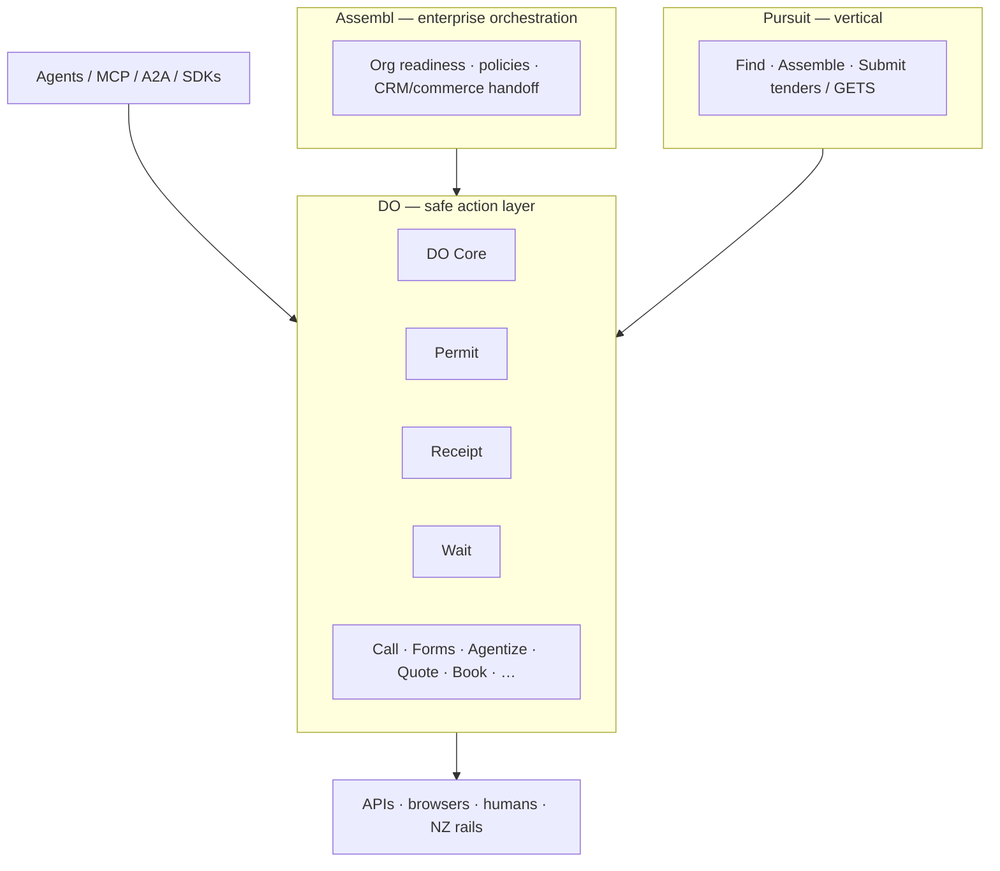

# Assembl / DO / Pursuit — Action Cloud Documentation Package

**Status:** Build brief package (not a claim of live production Action Cloud)  
**Audience:** Codex / coding agents, product & platform engineers  
**Locale:** NZ English  
**Last updated:** September 2026

This package is the canonical, repo-ready documentation set for the Assembl product family: enterprise orchestration (**Assembl**), the safe action layer (**DO**), and the first high-value vertical (**Pursuit**).

---

## Product family (preserve these distinctions everywhere)

| Brand | Role | One-liner |
|-------|------|-----------|
| **Assembl** | Enterprise orchestration | Make the organisation agent-ready |
| **DO** | Safe action layer | Give agents safe hands: know → prepare → permit → do → verify |
| **Pursuit** | First high-value vertical | Find / assemble / submit work (especially tenders) |

---

## How to use this package with build agents

1. Read **`CODEX.md`** first — product distinctions, non-goals, build order, auth interop rules.
2. Treat **`DO_ACTION_CLOUD.md`** as the product/build brief; **`ACTION_CONTRACT_SPEC.md`** as the canonical contract shape.
3. Use **`IMPLEMENTATION_ROADMAP.md`** for phases, folder layout, and backlog tickets.
4. Prefer NZ rails from **`NZ_ACTION_CLOUD.md`** only after verifying live endpoints (mark TBD until confirmed).
5. Opportunity prioritisation: **`AGENT_READY_API_OPPORTUNITY_MAP.md`**.
6. Demos and radar: **`DEMOS.md`**, **`DO_RADAR.md`**, watch items in **`SPONSORED_AGENT_JOURNEYS.md`** and **`DO_BROWSER_RUNTIME.md`**.

**Do not invent auth protocols.** Interop with OAuth agent delegation, AuthZEN, VCs, AP2, Visa TAP — do not invent replacements.

---

## File index

| File | Summary |
|------|---------|
| [README.md](./README.md) | Package index, family diagram, agent usage guide |
| [DO_ACTION_CLOUD.md](./DO_ACTION_CLOUD.md) | Full DO build brief: thesis, services, lifecycle, security, MVP |
| [NZ_ACTION_CLOUD.md](./NZ_ACTION_CLOUD.md) | Aotearoa Action Cloud rails (NZBN, LINZ, EA, banking, GETS, …) |
| [AGENT_READY_API_OPPORTUNITY_MAP.md](./AGENT_READY_API_OPPORTUNITY_MAP.md) | DO tools agents would pay for + pay signals |
| [ACTION_CONTRACT_SPEC.md](./ACTION_CONTRACT_SPEC.md) | Canonical Action Contract JSON + response schema + VAR metric |
| [SPONSORED_AGENT_JOURNEYS.md](./SPONSORED_AGENT_JOURNEYS.md) | Provider-neutral Sponsored Journeys brief (WATCH OpenAI Ads) |
| [DO_BROWSER_RUNTIME.md](./DO_BROWSER_RUNTIME.md) | Firefox Smart Window / Mistral Small 4 implications (WATCH) |
| [DO_RADAR.md](./DO_RADAR.md) | Global + NZ watchlist and Agentability Score rubric |
| [IMPLEMENTATION_ROADMAP.md](./IMPLEMENTATION_ROADMAP.md) | Phases 1–4, repo structure, backlog for first six |
| [DEMOS.md](./DEMOS.md) | Flagship and vertical demos |
| [CODEX.md](./CODEX.md) | Short agent instructions to continue without chat history |

---

## Working principles

- Concise but detailed; suitable for coding agents.
- No unsupported claims; speculative items marked **TBD** or **hypothesis**.
- This package describes what to build — it does **not** assert that Action Cloud is live in production.
- Commodity SaaS connectors and generic browse are covered by Composio / Pipedream / Browserbase; DO must not compete there.
