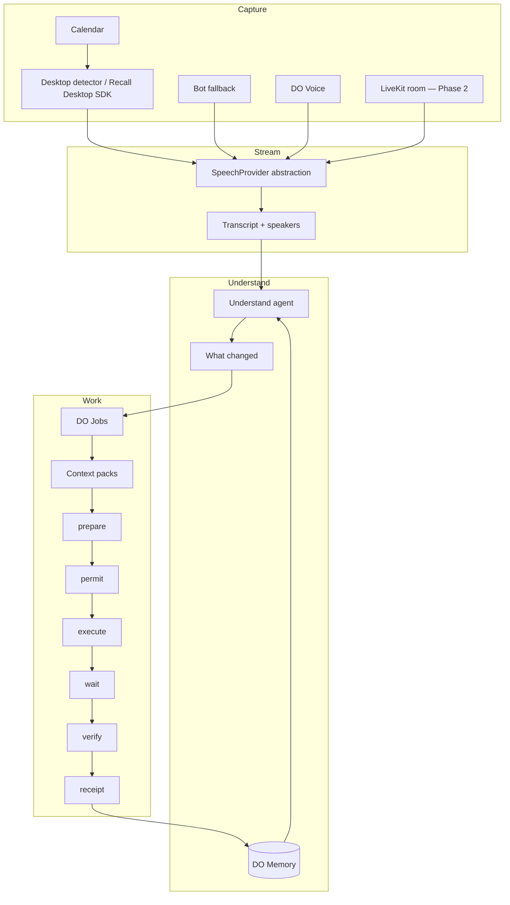

# DO Meet — Product Brief

**Working name:** DO Meet  
**One-liner:** Talk. Decide. DO.  
**Alt:** Meetings that turn themselves into work.  
**Brand nesting:** Assembl (orchestration) → DO (safe action) → DO Meet (meeting-to-execution)  
**First vertical consumer:** Pursuit  
**Status:** Build brief — not a claim of live production DO Meet  
**Locale:** NZ English

---

## 1. Product thesis

### 1.1 The commodity first half

Recording, transcription, and summaries are table stakes. Market references (not “we already use”):

| Reference | Typical strength | Where they stop |
|-----------|------------------|-----------------|
| **Granola** | Lightweight AI notes in meetings | Notes / summaries; limited governed execution |
| **Wispr Flow** | Fast voice → text | Dictation surface; not enterprise work graph |
| **Google Meet** (native AI features) | Capture inside Meet | Platform-bound; not Assembl/DO action layer |

Competing only on “better notes” is a losing game. Assembl’s scarce product is **safe, receipted work that starts in conversation**.

### 1.2 DO Meet thesis

```
conversation → understanding → decisions → work graph → agents → approvals → completed work
```

Meetings are the highest-bandwidth source of organisational change. DO Meet turns that change into:

1. **Understanding** — what changed, who owns it, what is blocked  
2. **Decisions** — explicit commits, not vibes  
3. **Work graph** — jobs with state, evidence, and links to people / projects  
4. **Agents** — specialists that prepare and execute under DO  
5. **Approvals** — SAFE / REVIEW / RESTRICTED via Permit  
6. **Completed work** — verified outcomes + Receipts + Memory

### 1.3 Proprietary layer (vs commodity)

| Layer | Commodity | DO Meet proprietary |
|-------|-----------|---------------------|
| Capture | Mic, bot, desktop audio | Capture as input only |
| Transcript / summary | Everyone | Infrastructure, not moat |
| Understand what changed | Weak | First-class delta vs prior meetings + CRM / Pursuit |
| Identify work | Action bullets in a doc | Typed DO Jobs |
| Assemble context | Copy-paste | Auto-assemble for tools / agents |
| Route | Email yourself | Specialist agents + queues |
| Do | Manual | prepare → permit → execute |
| Approve | Hope | SAFE / REVIEW / RESTRICTED |
| Verify | None | Post-conditions + evidence |
| Remember | Lost in Drive | DO Memory + receipts |

---

## 2. Four modes

### Mode A — DO Meet (LiveKit-hosted)

Assembl-owned meeting rooms via **LiveKit** (reference infra; integration **planned**).

- Hosted video/audio when the org wants the room inside Assembl/DO  
- Native Live DO surface mid-call  
- Strongest control over consent UX, recording policy, and agent presence  
- **Not an MVP blocker** — Phase 2

### Mode B — DO Capture (external meetings)

Capture from Google Meet, Zoom, Microsoft Teams without forcing a platform switch.

- **Preferred:** Recall.ai Desktop SDK path — bot-free desktop capture (reference vendor)  
- **Fallback:** meeting bot join when desktop capture is unavailable or policy requires it  
- Calendar-aware detection of “you’re in a meeting”  
- Primary MVP capture path

### Mode C — DO Voice (Wispr-like)

Voice as a first-class input to DO — not only meetings.

- Dictation → structured intent → DO Jobs  
- Ambient “afterthought” capture (“remind me to send the pursuit pack”)  
- Shares understanding + job pipeline with Modes A/B  
- Thin MVP (desktop voice → job draft); richer mobile later

### Mode D — DO Memory

Cross-meeting continuity.

- Promises, decisions, open jobs, people, projects  
- “What did I promise last time?” queries  
- Feeds understanding (“what changed since last Hui with this client”)  
- Evidence-linked; not a free-floating chatbot memory dump

---

## 3. Meeting lifecycle UX

### 3.1 Before

| Element | Behaviour |
|---------|-----------|
| Calendar sync | Upcoming events; detect Meet/Zoom/Teams links |
| Prep brief | Attendees, prior promises, open DO Jobs, Pursuit/CRM context (**planned** depth) |
| Consent / policy | Recording & capture policy visible; NZ Privacy Act mindset (IPP-aware UX — **TBD** legal copy) |
| Mode select | Hosted (A) vs Capture (B) vs Voice-only (C) |

### 3.2 During

| Element | Behaviour |
|---------|-----------|
| Note window | Lightweight desktop overlay: live partial understanding, not a wall of transcript |
| Speakers | Diarisation when available; manual fix later |
| Live DO | Spot intents mid-call (“Build that”, “Send that”, “Book Friday”) → draft jobs without leaving the call |
| Detector | Desktop knows active conferencing app / call state (MVP) |

### 3.3 End — signature UX

The product moment is **not** “here’s your summary”.

**Meeting assembled** screen:

1. What changed (delta)  
2. Decisions (explicit)  
3. DO Jobs ready (typed, ranked, risk-classed)  
4. **DO ALL** / selective approve  
5. Evidence & Memory write-back  

Copy tone: calm, operational, Assembl — not “✨ AI magic notes”.

---

## 4. Live DO

Mid-meeting, low-friction path from utterance → prepared job.

**Examples:**

- “Build that” → Studio / brief trigger job (REVIEW)  
- “Send Sarah the pack” → email draft job with assembled context (REVIEW)  
- “Put it in Pursuit” → Pursuit update job (SAFE or REVIEW by tenant policy)  
- “Hold Friday 2pm” → calendar propose job (REVIEW)

Live DO never silently executes RESTRICTED work. It **prepares**; Permit gates apply.

---

## 5. Work engine

### 5.1 Job schema (logical)

```json
{
  "job_id": "dj_...",
  "meeting_id": "mtg_...",
  "source": {
    "kind": "meeting_end | live_do | voice | memory_followup",
    "span_refs": ["tr_..."],
    "utterance_excerpt": "optional short quote"
  },
  "title": "Draft follow-up to Sarah — contract pack",
  "type": "email_draft | calendar | task | pursuit_update | brief_studio | custom",
  "risk_class": "safe | review | restricted",
  "owner_user_id": "usr_...",
  "assignee_agent": "agent.email | agent.calendar | ...",
  "context_pack_id": "ctx_...",
  "action_prep_id": null,
  "permit_id": null,
  "receipt_id": null,
  "state": "proposed",
  "evidence_ids": [],
  "created_at": "2026-09-17T09:00:00+12:00",
  "updated_at": "2026-09-17T09:00:00+12:00"
}
```

Field names may map 1:1 to Action Contract prepare/execute once Phase 1 exists; do not fork semantics.

### 5.2 Job states

```
proposed → prepared → awaiting_permit → permitted → executing
  → waiting → verifying → completed
  → failed | cancelled | undone | escalated
```

Align status vocabulary with Action Cloud universal response where possible (`accepted`, `in_progress`, `waiting`, `succeeded`, `failed`, `cancelled`, `escalated`, `undone`).

### 5.3 What DO can do (MVP job types)

| Type | Outcome | Default risk |
|------|---------|--------------|
| **Email draft** | Draft in Gmail (or equivalent); user sends or DO sends under permit | REVIEW |
| **Calendar** | Propose / create event, hold slot | REVIEW |
| **Task** | Create task in Assembl / connected tracker | SAFE / REVIEW |
| **Pursuit update** | Update opportunity / tender workspace | REVIEW |
| **Brief / Studio trigger** | Kick brief or Studio generation with meeting context | REVIEW |
| **Approval queue item** | Escalate to human queue | — |
| **Receipt attach** | Bind evidence to completed work | SAFE |

Extended types (call, forms, book, NZ rails) come from DO Action Cloud catalogue — Meet only *originates* them.

---

## 6. Approvals — SAFE / REVIEW / RESTRICTED

| Tier | Meaning | Default behaviour |
|------|---------|-------------------|
| **SAFE** | Low blast radius; reversible or draft-only | Auto-permit within tenant policy |
| **REVIEW** | External or durable side effects | Human confirm in queue / end screen |
| **RESTRICTED** | Legal, payment, tender submit, irreversible | Dual control / DO Human; never Live-DO auto |

Maps to Action Cloud `risk_class` (`low` / `medium` / `high` / `critical`) — use a single mapping table in code; do not maintain two contradictory enums without a bridge.

**Evidence-first:** every completed consequential job emits or links a **Receipt** (and optional evidence pack). “Done” without proof is not done.

---

## 7. Specialist agents (initial list)

| Agent | Role |
|-------|------|
| **Understand** | Delta, decisions, promises, blockers from transcript + history |
| **Jobsmith** | Turn understanding into typed DO Jobs + context packs |
| **Email** | Draft / send under permit |
| **Calendar** | Schedule / reschedule |
| **Pursuit** | Tender / opportunity updates |
| **Studio / Brief** | Creative or strategy brief triggers |
| **Approver** | Present diffs; collect permits |
| **Verifier** | Post-condition checks |
| **Memory** | Write/read cross-meeting memory |
| **Scribe** | Note window UX; speaker fixes; export |

Agents propose; **DO** authorises and executes. Do not let the LLM hold long-lived credentials.

---

## 8. Realtime pipeline



SpeechProvider abstracts STT vendors; swap without rewriting the work engine.

---

## 9. Connectors

| Connector | Role | Status posture |
|-----------|------|----------------|
| Google Calendar | Detect meetings, create holds | Prefer existing Assembl Calendar OAuth if present |
| Google Meet / Zoom / Teams | External capture targets | Via Capture mode |
| Recall.ai Desktop SDK | Bot-free capture | Reference vendor — wire when licensed |
| Recall.ai bot | Fallback join | Reference vendor |
| LiveKit Cloud | Hosted Mode A | Phase 2 |
| Gmail / email | Drafts & send under permit | Via DO email tool |
| Pursuit | Opportunity / tender updates | First vertical |
| Studio / Brief | Generation triggers | Assembl surface |
| Action Cloud | Permit / Wait / Receipt | Sibling package |

Do not claim connectors are live until shipped and verified.

---

## 10. Meeting object

Logical `Meeting` (persist in Supabase — see `ARCHITECTURE.md`):

| Field group | Contents |
|-------------|----------|
| Identity | `meeting_id`, tenant, title, calendar_event_id |
| Mode | A / B / C / hybrid |
| Participants | people, emails, speaker map |
| Time | scheduled / actual start-end (store with zone) |
| Capture | provider, consent flags, media refs (**policy TBD**) |
| Transcript | segments, speakers, confidence |
| Understanding | decisions, deltas, promises, blockers |
| Jobs | `job_id[]` |
| Memory links | prior `meeting_id[]`, thread keys |
| Artefacts | exports, receipts, evidence packs |

---

## 11. Cross-meeting views

- **Promises I made** / **Promises to me**  
- **Open DO Jobs** by person, project, Pursuit  
- **Decision log** across a relationship  
- **What changed since last meeting** (default Understand input)

These views are Mode D surfaces; they must link to receipts and source spans (evidence-first).

---

## 12. DO Home

Home is the operational cockpit, not a chat dump:

- Approval queue (REVIEW / RESTRICTED)  
- Today’s meetings + capture status  
- Jobs in flight (waiting / verifying)  
- Memory prompts (“3 open promises before 3pm client call”)  
- Pursuit / Studio hooks when relevant  

Visual language: Assembl home patterns — plum / rose / off-white — see Design.

---

## 13. UX principles

1. **Work over words** — summary is secondary; jobs are primary.  
2. **Evidence-first** — show why a job exists (quote / span).  
3. **Prepare before permit** — never surprise-send.  
4. **Calm confidence** — operational UI; no purple AI clichés.  
5. **Human remains sovereign** on REVIEW / RESTRICTED.  
6. **One graph** — meetings, jobs, memory, receipts share IDs.  
7. **NZ English** — colour, organisation, artefact spelling in product copy.  
8. **Consent visible** — capture is explicit, not sneaky.

---

## 14. Design

| Token | Direction |
|-------|-----------|
| Palette | Plum / rose / off-white (Assembl family) |
| Type | Jost / Assembl type system |
| Avoid | Generic purple gradients, sparkle bots, “AI” candy UI |
| Density | Desktop-first operational; generous but not sparse |
| Signature end UX | “Meeting assembled” + job cards + DO ALL |
| Motion | Short, purposeful state changes — not decorative Lottie spam |

Assets and exact tokens: follow Assembl brand pack in monorepo when present; do not invent a second brand.

---

## 15. North-star day-in-life

**Kate, Thursday (PT / Auckland time).**

1. **08:40** — DO Home: two open promises before a 09:00 Pursuit call; one REVIEW email from yesterday waiting.  
2. **09:00** — External Zoom (Mode B). Desktop detector arms Capture; note window stays thin.  
3. **09:18** — Client: “Can you rebuild the capability page?” → Live DO drafts a Studio brief job (REVIEW).  
4. **09:45** — Call ends → **Meeting assembled**: delta, three decisions, five jobs. Kate hits **DO ALL** on SAFE + selected REVIEW.  
5. **09:47** — Email draft + Pursuit update prepare; calendar hold for Friday; Studio trigger queued. Receipts land as each verifies.  
6. **14:00** — Cross-meeting: “What did I promise?” → two items still open; one auto-closed by receipt.  
7. **17:10** — DO Voice in the car park: “File that we need LINZ parcel check on the next tender” → Memory + future Pursuit job seed.

That day is the product. Notes were never the point.

---

## 16. Explicit non-claims

- DO Meet is **not** asserted as live in production in this brief.  
- LiveKit, Recall.ai, Granola, Wispr Flow, Google Meet are **references**.  
- Hui / Hapai history in the Assembl monorepo may inform reuse (Calendar OAuth, polish prompts) but DO Meet is the product framing going forward.  
- NZ Privacy / consent copy is **TBD** with legal.  
- Pricing is **TBD**.
