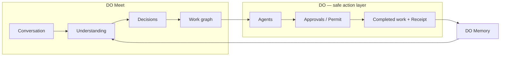

# Assembl / DO — DO Meet Documentation Package

**Working name:** DO Meet  
**One-liner:** Talk. Decide. DO.  
**Alt:** Meetings that turn themselves into work.  
**Status:** Build brief package (not a claim of live production DO Meet)  
**Audience:** Codex / coding agents, product & platform engineers  
**Locale:** NZ English  
**Last updated:** September 2026

This package is the canonical, repo-ready documentation set for **DO Meet** — the meeting-to-execution system under **DO**, Assembl’s safe action layer. Suggested host path once copied into the monorepo: `docs/do-meet/` (alongside `docs/do-action-cloud/`).

---

## Product family (preserve these distinctions everywhere)

| Brand | Role | One-liner |
|-------|------|-----------|
| **Assembl** | Enterprise orchestration | Make the organisation agent-ready |
| **DO** | Safe action layer | Give agents safe hands: know → prepare → permit → do → verify |
| **Pursuit** | First high-value vertical | Find / assemble / submit work (especially tenders) |
| **DO Meet** | Meeting-to-execution under DO | Talk. Decide. DO. |

DO Meet is **not** a standalone note-taker brand. It is how meetings enter the DO work graph: conversation becomes decisions, decisions become jobs, jobs become approved, receipted work.

---

## Thesis (short)

Most meeting tools stop at the commodity half of the job: record, transcribe, summarise. Granola, Wispr Flow, Google Meet (and similar) compete there — useful, but not proprietary for Assembl.

**DO Meet’s thesis:**

> conversation → understanding → decisions → work graph → agents → approvals → completed work

Transcription and summaries are infrastructure. The proprietary layer is:

**understand what changed → identify work → assemble context → route → do → approve → verify → remember**

All consequential steps run through DO’s Action Contract lifecycle (see sibling package).

---

## Four modes (overview)

| Mode | Codename | Job |
|------|----------|-----|
| **A** | DO Meet (hosted) | LiveKit-hosted meetings where Assembl owns the room |
| **B** | DO Capture | Capture from external Meet / Zoom / Teams (Recall desktop bot-free preferred; bot fallback) |
| **C** | DO Voice | Wispr-like dictation / ambient voice → DO jobs |
| **D** | DO Memory | Cross-meeting memory, promises, and work graph continuity |

MVP prioritises **B + work engine** (and thin C/D). Native hosted video (**A**) is Phase 2 — not an MVP blocker. Details: `DO_MEET_PRODUCT.md`, `MVP_AND_PHASES.md`.

---

## Relationship to `docs/do-action-cloud/`

DO Meet **consumes** DO Core; it does not reinvent authority, waits, or proof.

| Action Cloud concept | DO Meet use |
|----------------------|-------------|
| **Action Contract** | Every DO Job is (or maps to) a contract instance |
| **Permit** | SAFE / REVIEW / RESTRICTED gates before execute |
| **Wait** | Human review, calendar confirmations, async agent work |
| **Receipt** | Evidence-first completion of meeting-originated work |
| Lifecycle | `discover → inspect → quote/dry-run → prepare → permit → execute → wait → verify → receipt → undo/escalate` |

Canonical specs live in the Action Cloud package (reference as sibling docs, not “already live”):

- `docs/do-action-cloud/DO_ACTION_CLOUD.md`
- `docs/do-action-cloud/ACTION_CONTRACT_SPEC.md`
- `docs/do-action-cloud/IMPLEMENTATION_ROADMAP.md` (Phase 1 = Contract core)

If Action Cloud Phase 1 is present in the host repo, map DO Jobs onto prepare / permit / execute / wait / verify / receipt rather than inventing a parallel job runtime. See `ARCHITECTURE.md`.

**Vendor references (not “we already use”):** LiveKit, Recall.ai, Granola, Wispr Flow, Google Meet — cited as market / infra references only unless a connector is explicitly shipped.

---

## How to use this package with build agents

1. Read **`CODEX.md`** first — build order, non-goals, proprietary layer.
2. Treat **`DO_MEET_PRODUCT.md`** as the full product brief.
3. Use **`MVP_AND_PHASES.md`** for scope cuts and quality bar.
4. Implement against **`ARCHITECTURE.md`** (stack, schema, tool interface).
5. Demo scripts: **`DEMOS.md`**.
6. Keep Action Cloud docs open when wiring approvals and receipts.

---

## File index

| File | Summary |
|------|---------|
| [README.md](./README.md) | Package index, thesis, four modes, Action Cloud link |
| [DO_MEET_PRODUCT.md](./DO_MEET_PRODUCT.md) | Full product: modes, UX, jobs, approvals, design, north star |
| [MVP_AND_PHASES.md](./MVP_AND_PHASES.md) | MVP first (work engine), Phase 2–3, quality checklist |
| [ARCHITECTURE.md](./ARCHITECTURE.md) | Stack, Supabase tables, tool interface, Action Cloud mapping |
| [CODEX.md](./CODEX.md) | Agent continuation brief — build work engine first |
| [DEMOS.md](./DEMOS.md) | Flagship demos: assembled, Live DO, cross-meeting promises |

---

## Working principles

- Concise but detailed; Codex-ready.
- NZ English throughout.
- No unsupported live / production claims; mark **TBD** / **planned** / **hypothesis**.
- Vendor names are **references**, not assertions of existing integrations.
- Commodity note-taking is not the product; the work engine is.
- Strip and avoid weird cite tokens; plain product names only.
