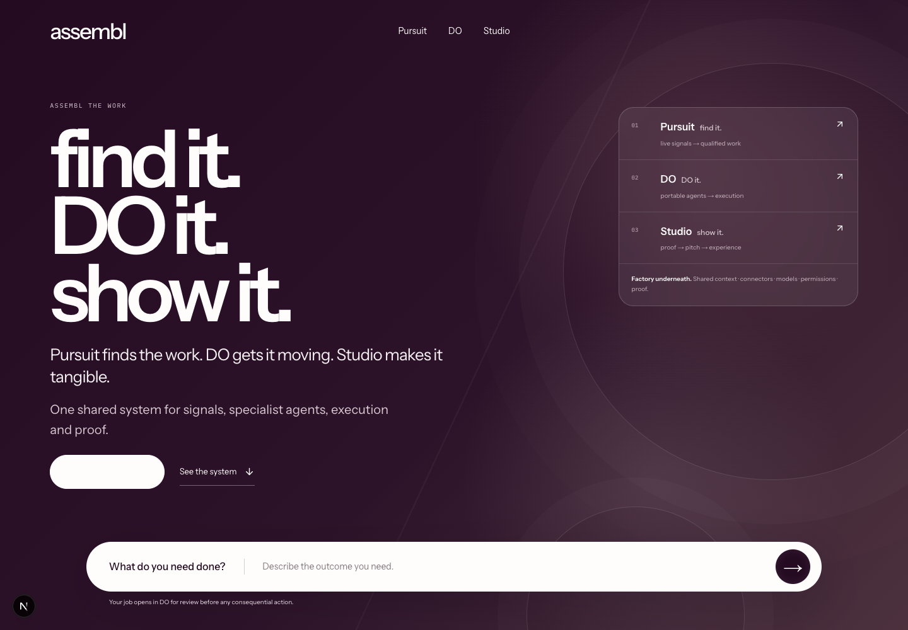
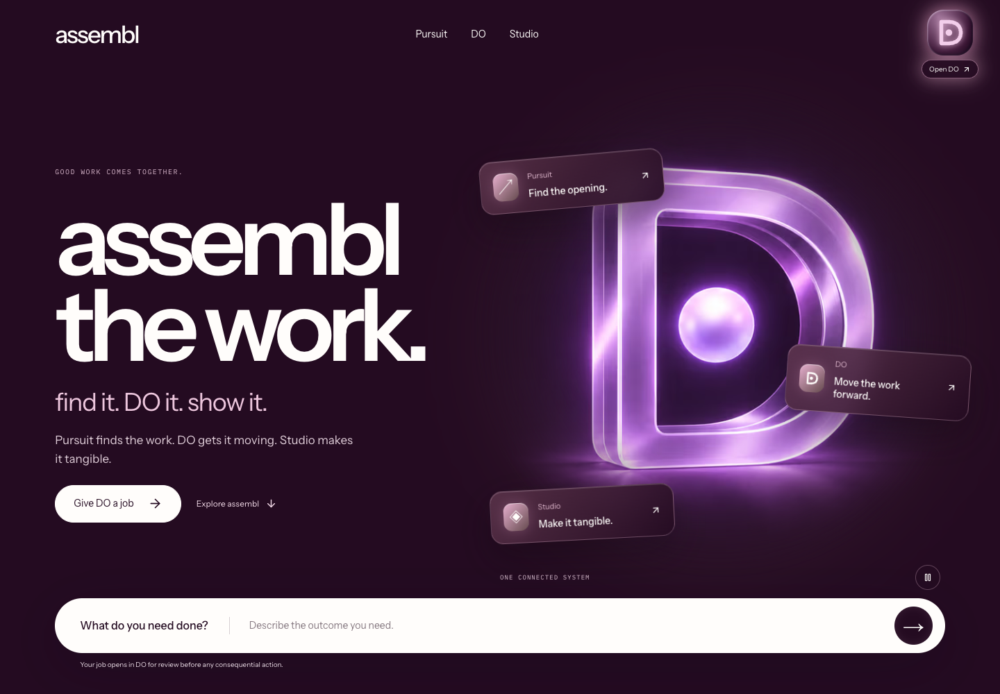
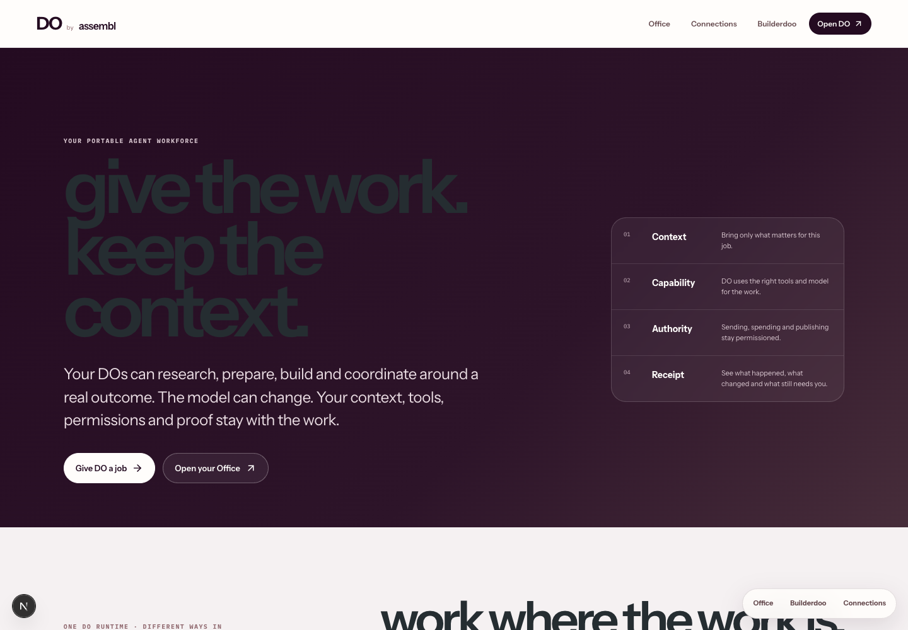
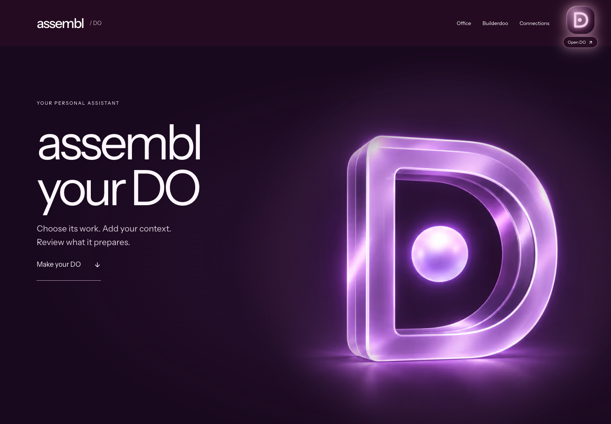
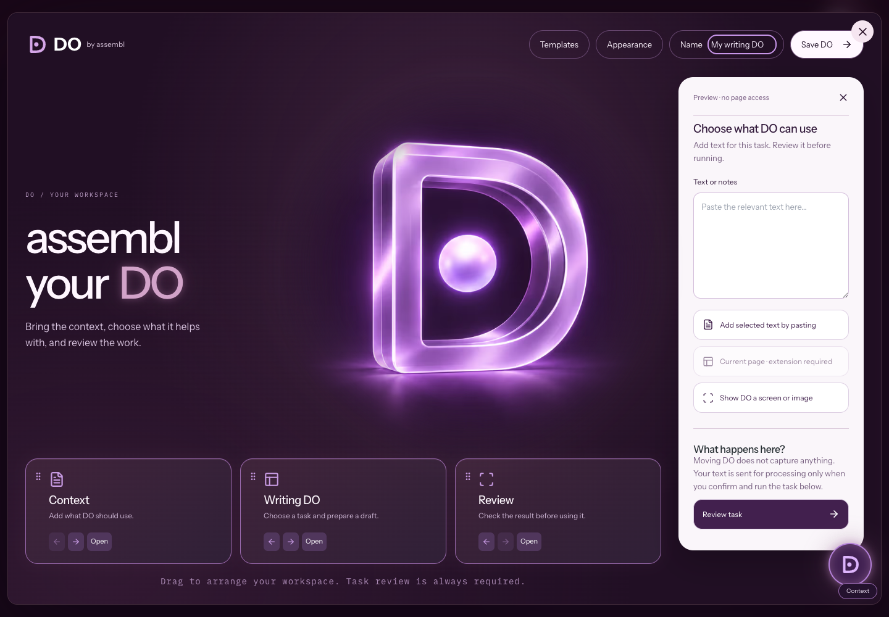
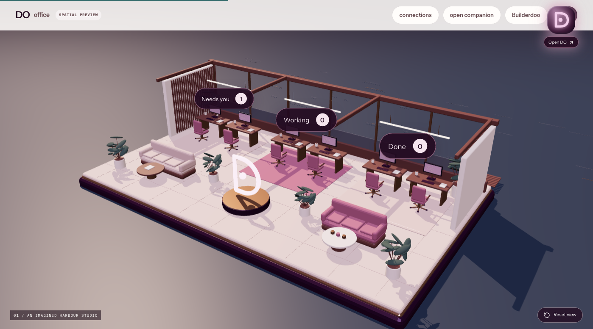
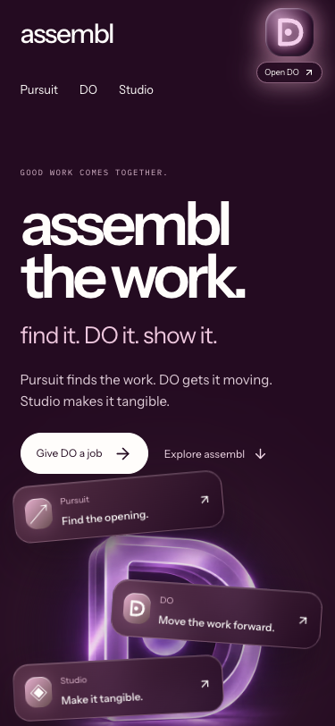
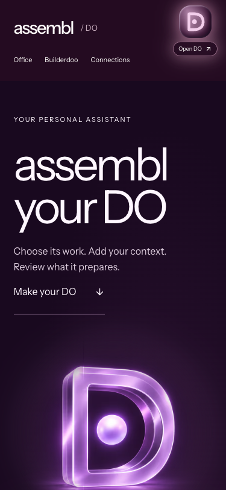
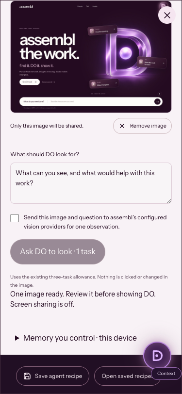

# assembl / DO recovery proof

16 September 2026. Recovery based on main `51759a8923a2546ee7913a61f9c49dadba3dd14a`.

## Result

`/` remains the assembl company front door, with Pursuit, DO and Studio. Plum/rose glow, the dimensional D, scroll motion, the approved plum film and a movable companion return. `/do` restores the visual specialist selection and Context / Skill / Review canvas from the owner's previous Codex task. Names, appearances, module order and recipes can be saved on this device. Saving after a fresh page load preserves existing recipes.

The newer Builderdoo, Office state, model router, connector broker, Gmail pilot, Gemini Live and security controls remain. [The baseline and displacement history](../../DO-VISUAL-BASELINE.md) explains which commits removed the intended UI and which recovered features had only existed as uncommitted local work.

The Office now includes an editable Blender scene, a 676 KB compressed browser model, furnished review/build/proof areas and four camera views. The model loads on request. Its task markers use the same counts and links as the existing demo Office board.

**Show DO** adds explicit vision: choose a tab/window still or upload a screenshot/photo, review the image, then consent and ask. Screen sharing stops after one frame. A reviewed observation can be added to a task. Moving the companion never activates capture.

## Visual proof

### Company homepage

Before:

After, local production build at 1440 × 1000:

### DO and its actual workspace

Before:

After:

### Interactive Office

The interactive Office capture was made in the local development browser. Homepage, DO, canvas and phone screenshots above/below were refreshed against the local production build.

### Phone layouts and image review

## Verification

| Check | Result |
| --- | --- |
| Production build | Passed, Next.js 16.2.6; TypeScript and 202 prerendered pages completed. Dummy public backend configuration, no copied credentials. |
| DO/runtime/security tests | 134 passed; 2 opt-in provider smoke tests skipped, across 27 passing files and one skipped file. |
| Changed-source ESLint | Passed with zero warnings. Unmodified generated Draco decoder is excluded from source lint. |
| Repository-wide lint | Not green: the initial audit reported 1,155 errors and 245 warnings. Only two findings involved recovery files; both were fixed. The remaining findings belong to untouched code. |
| Context and macron checks | Passed; context check reports 33 existing brand-review warnings outside these restored front doors. |
| Desktop browser | Homepage, DO and open canvas rendered with zero page errors in a fresh production-browser session; one main landmark. |
| Phone browser | Homepage and DO have 375 px document width at a 375 × 812 viewport. Heading contrast and launcher visibility checked. |
| Companion persistence | Actual pointer drag changed position, did not open the dialog, and restored the same coordinates on reload. Alt-arrow movement and reset also checked. |
| Specialist selection | Writing DO dragged into the selected workspace, then opened the writing recipe; selection alone ran no task. |
| Saved recipes | Reopened the saved name and module recipe. A second recipe saved after a new page load retained both entries after reload. |
| Homepage handoff | The typed brief reached the actual workspace; the URL carried an opaque handoff ID, not the brief. |
| Motion controls | Reduced motion kept the film paused; explicit play worked, pause stopped it; DO used its static accessible reveal layout. |
| Office navigation | Browser GLB loaded, camera selection worked, and board/scene links displayed the same counts. Existing Three/R3F deprecation warnings remain. |
| Vision UI | Real screenshot upload, local preview, remove action and disabled Ask button before consent checked. No image was submitted to a provider in browser QA. |
| Vision capture lifecycle | Controlled synthetic MediaStream test captured one frame and confirmed all tracks ended; a rejected picker produced a notice and no image. This is not proof of an actual OS chooser interaction. |
| Vision server | Five route tests cover valid decoded image/receipt, invalid origin, missing consent, corrupt image and exhausted allowance. Image decoding uses a real Sharp fixture; provider and quota calls are mocked. |
| Local conversation boundary | In the production build, POST `/api/do/live` returned 403. Hosted `/do/live` and `/do/travel` redirected to supported preparation routes. |
| Mac companion | Swift build, bundle metadata and strict code-signature verification passed in a temporary non-synced directory. Position/visibility and opt-in login source were preserved. No reboot test, installation or notarised public release is claimed. |

## What remains unproven

At the pre-release production check, the preparation provider was configured but the current network's public allowance was **0 of 3 tasks remaining**. Hosted generation, new vision completion, Gemini microphone conversation and Gmail OAuth were therefore not verified as complete user journeys in this recovery. A local extraction attempt also failed closed because the isolated checkout has no live trial database. No quota bypass or successful-provider claim was introduced.

The recovered OpenAI text/voice service runs only in development on localhost. The Office remains a demo runtime; it is not an authenticated durable team workspace. Recipes and explicit memory notes are device-local. Browser screen capture availability varies; phones and the Mac helper can use image upload. Native Mac screen capture and continuous vision are not implemented.

[Gaussian splat research](../../DO-SPATIAL-TOOLS-REVIEW.md) recommends Spark for a future high-quality spatial background and SuperSplat for editing. This release ships authored Blender geometry; it does not claim a completed Gaussian-splat integration.

## Release and automatic updates

The owner subsequently authorised this recovery to move to main and publish. The PR retains the review record before merging. The connected Vercel Git integration publishes changes merged to main; DO validation and Mac build workflows now also run on main. The public-front-door guard is part of production builds, so the restored identity is checked during release. This does not automatically merge future work or publish uncommitted local edits.

Exact PR, merge SHA and production deployment status must be recorded after release; build success alone is not deployment proof.
