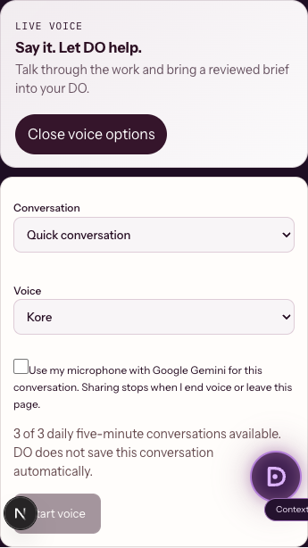

# DO: voice and public account entry

## Result

The recovered Direction-C homepage and DO canvas remain in place. Voice now opens within the actual DO task editor. A person can choose a voice, explicitly include the displayed task text, talk, interrupt audio, review a prepared brief, and add it to their task. Ending voice, leaving the page, or cancelling startup releases browser microphone and audio resources. A late microphone permission result cannot restart a cancelled session.

This extends the existing DO owner, preparation and persistent allowance primitives. It does not activate an agent or send an email through a voice tool.

## Why login needed a repair

The public splash middleware previously redirected **every** `/login` request to `/`, even though `/login` also appeared in its exemption list. `/auth/*` and magic-link origins were redirected to the private operator host. Personal DO users could not establish their session through that path.

DO returns now keep `/login?redirect=/do…` and `/auth/confirm` or `/auth/callback` on the public workspace host. Operator returns retain their private host. Return paths are normalised and checked against protocol-relative URLs, backslashes and off-site redirects. Failed confirmation links retain the DO destination for retry.

## Gemini contract

- Google GenAI SDK **2.22.0** mints one-use, five-minute ephemeral tokens through `v1beta`. The long-lived provider key stays server-side.
- Each token locks the model, voice, system instruction and prepare-only tool. Standard `gemini-3.8-live` omits thinking configuration; Extended Thinking uses `LOW` and omits function-response scheduling.
- Authenticated account, same-origin request and explicit microphone consent required before minting. Three daily session starts per account, reset at midnight Pacific/Auckland. Existing deployed unique database indexes arbitrate concurrent reservations. Failed mint attempts attempt to release their reservation; a successful mint consumes the daily start even if the later connection fails.
- Microphone frames start only after `setupComplete`; input carries the actual PCM sample rate. Output PCM is played at 24 kHz. Interruptions stop queued output. Duplicate or cancelled tool IDs cannot run twice.
- Transcript is held in browser memory for that session. It is not automatically written to assembl storage. Google's own data terms still apply.
- The system asks for natural New Zealand English. No specific New Zealand accent is promised without listening to the chosen voice.

Primary references checked 16 September 2026: [Google ephemeral tokens](https://ai.google.dev/gemini-api/docs/live-api/ephemeral-tokens), [Live capabilities](https://ai.google.dev/gemini-api/docs/live-api/capabilities), [models](https://ai.google.dev/gemini-api/docs/models).

## Proof

- Production build, TypeScript and focused source lint passed. Macron checks passed.
- 215 tests passed (2 provider opt-in checks skipped) across the DO runtime, voice token boundaries, quota concurrency/owner separation/NZ reset, preparation, public login routing and existing private-client routing.
- An additional test exercises the installed Google SDK against a controlled HTTP response and verifies its real `v1beta/auth_tokens` request, immutable `bidiGenerateContentSetup`, one-use limit and omission of a field mask that would permit client overrides.
- Browser lifecycle test used **synthetic MediaStreams and a controlled WebSocket**, with the real AudioWorklet: zero microphone frames before setup; actual input `audio/pcm;rate=48000`; no implicit context sharing; one brief execution for repeated tool ID; reviewed brief reaches the task; interruption stops output; end stops every track and closes socket; cancellation while permission is pending stops the late stream; microphone rejection mints no token; no page errors; 375px content fits a 375px viewport.
- Screenshot below shows the mobile controls from that controlled browser run. It is not evidence of a successful Google conversation.

## Release verification still required

Production Gemini key exists but voice flag was disabled before this change. After checked release, enable `DO_GEMINI_LIVE_ENABLED=true`, sign in through the repaired DO path and verify a short real Gemini conversation. Provider billing/quota and the accent are unverified until that succeeds. No top-up requirement has been established.

Rollback: set `DO_GEMINI_LIVE_ENABLED=false` and redeploy the same release. The rest of DO remains available.
