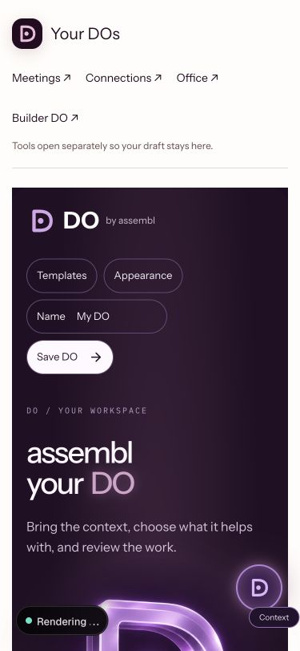

# Companion workspace continuity

The Mac companion and browser embed load `/do/widget`, which uses the same DoBuilder as the main DO workspace. It is not a separate backend. The widget lacked direct routes to newer Meeting DO, Connections, Office and Builder DO surfaces.

## Changed

- Added a responsive tools header using the shared D mark and Instrument Sans.
- Tools request a separate tab/window with `noopener`, keeping the editor in place.
- Removed duplicated assembl from the widget page title.
- Receiving companion context now announces its arrival and focuses the editable context field. Preparation still requires review. No task execution, capture or account grant is triggered by this message.

## Verification

- A temporary parent-page iframe harness offered synthetic text through the actual `assembl-do:context` message handler.
- Both context fields showed the sample, the editor received focus, and the status message appeared. The next action remained Review inputs & run. The harness was removed after testing.
- 375px browser layout inspected; document width and viewport width both 375px.
- All four tool links have the intended route, `_blank` target and `noopener` relation. A Meeting link click left the original editor in place; the in-app browser did not expose a new tab, so destination launch is not claimed as verified.
- Scoped lint, TypeScript, production build and brand guard passed.

The native Mac handoff itself remains unverified while the Mac is locked. No provider task, Gmail grant, recording session or production deployment was performed in this check. This connects navigation and review feedback; it does not establish that those external capabilities are configured.

